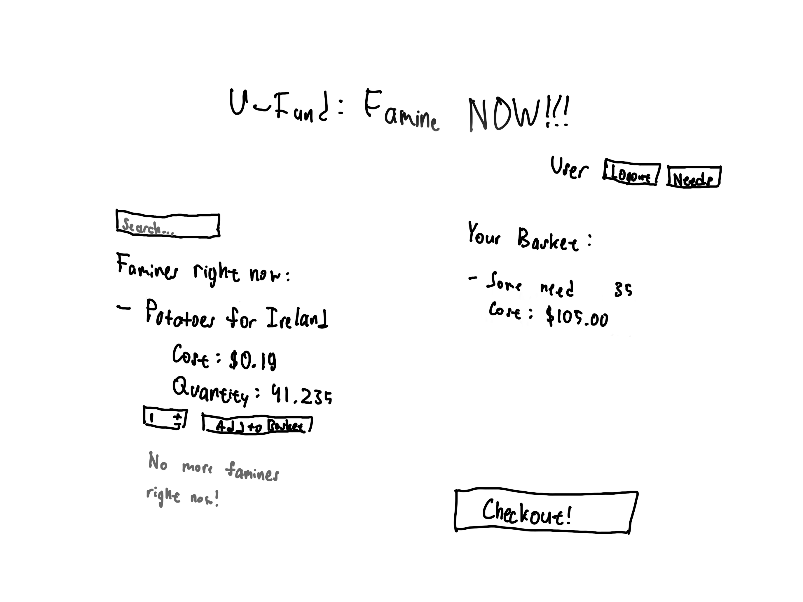
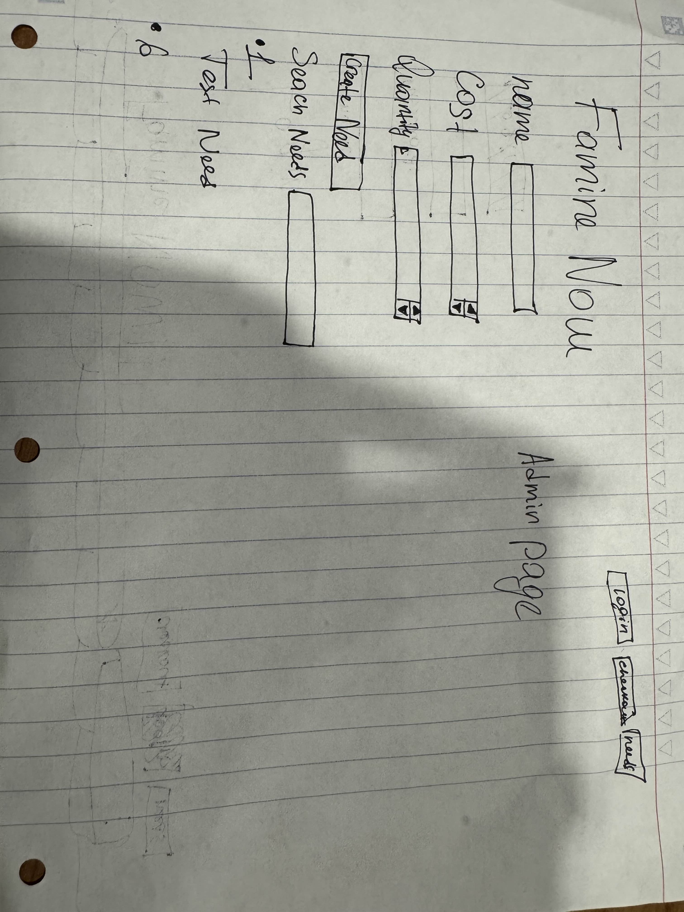
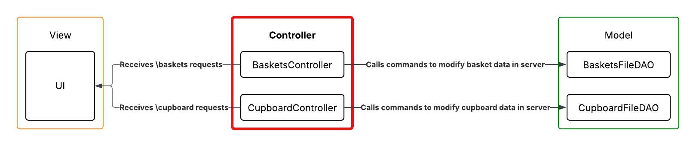
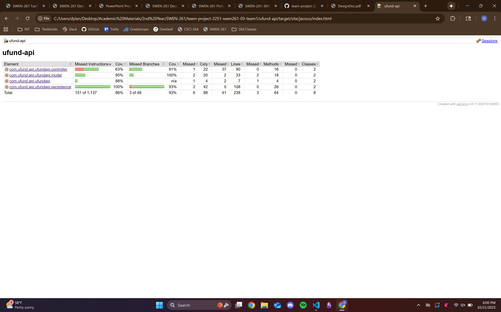

# PROJECT Design Documentation

> _The following template provides the headings for your Design
> Documentation.  As you edit each section make sure you remove these
> commentary 'blockquotes'; the lines that start with a > character
> and appear in the generated PDF in italics but do so only **after** all team members agree that the requirements for that section and current Sprint have been met. **Do not** delete future Sprint expectations._

## Team Information
* Team name: Team1
* Team members
  * Anthony Salsbury
  * Dylan Sward
  * Vladislav Kudin
  * Giovanni Pirrih

## Executive Summary

This is a summary of the project.

### Purpose

The project is a website that users can go to and give donations to resolution efforts for various famines. One important user group is the admin, who needs to be able to add, delete, and update information of the different famines in order for users to contribute to current efforts. The other important group are the helpers, who want to contribute to specific efforts and are using this website to do so.

>  _**[Sprint 4]** Provide a very brief statement about the project and the most
> important user group and user goals._

### Glossary and Acronyms
> _**[Sprint 4]** Provide a table of terms and acronyms._

| Term | Definition |
|------|------------|
| SPA | Single Page |

## Requirements

This section describes the features of the application.

> _In this section you do not need to be exhaustive and list every
> story.  Focus on top-level features from the Vision document and
> maybe Epics and critical Stories._

### Definition of MVP

The Minimum Viable Product will provide different functionality for users depending on how they log-in through our authenticator. Helpers will be able to see/search for ongoing famine efforts that need contributing to, and they will be able to add and remove them from their shopping baskets. These baskets will then be able to be checked-out once the helper is done modifying it. Admin users, who utilize the special "admin" login information, can add, remove, edit, and see ongoing famine effort listings, but will not have their own baskets nor can they see the baskets of others.

In order to assist helper users with choosing their contributions, our product also stores geographical information about the famines, and allows for the search of famines based on this location information.

> _**[Sprint 4]** Provide a simple description of the Minimum Viable Product._

### MVP Features
>  _**[Sprint 4]** Provide a list of top-level Epics and/or Stories of the MVP._

### Enhancements
> _**[Sprint 4]** Describe what enhancements you have implemented for the project._

## Application Domain

This section describes the application domain.

The main users of the program are the U-fund Manager and the helpers. The U-fund manager adds needs (the famine efforts) to the cupboard, and is also able to edit their information and remove them entirely. The helpers can move these needs from the general cupboard into their personal baskets, which will hold the needs until the helper is ready to move them to checkout.

> _**[Sprint 4]** Provide a high-level overview of the domain for this application. You
> can discuss the more important domain entities and their relationship
> to each other._

## Architecture and Design

This section describes the application architecture.

### Summary

The following Tiers/Layers model shows a high-level view of the webapp's architecture. 
**NOTE**: detailed diagrams are required in later sections of this document.

The web application, is built using the Model–View–ViewModel (MVVM) architecture pattern. 

The Model stores the application data objects including any functionality to provide persistance. 

The View is the client-side SPA built with Angular utilizing HTML, CSS and TypeScript. The ViewModel provides RESTful APIs to the client (View) as well as any logic required to manipulate the data objects from the Model.

Both the ViewModel and Model are built using Java and Spring Framework. Details of the components within these tiers are supplied below.

### Overview of User Interface

This section describes the web interface and flow; this is how the user views and interacts with the web application.

#### Sprint 1 Sketch

The following is a sketch of our plan for the helper page, where helpers, once logged in, will be able to move needs between the cupboard and their basket. They can also search for needs with a search bar, or logout if they want to leave. Once they are ready, there will also be a checkout button so that they can finalize their contributions. 

#### Flow of Application's UI

The application's UI will feature a home page that initially shows users a list of ongoing famine efforts. This page will also direct them to a sign-in page, where they can enter their username and password in order to log into their accounts. From here, the admin will see a master page where they can add, remove, and edit needs, while the helpers will see their basket and a list of needs, which they are able to move specific things between. From these pages, all users will have the ability to logout with a logout button near where the original login button was. Additionally, each page will have a button to take the user back to their primary screen (determined by what account they are signed in as).

The following are sketches of the Login and Admin pages. The above image, which is a sketch of the Helper page, also represents a part of the UI.

> _Provide a summary of the application's user interface.  Describe, from the user's perspective, the flow of the pages/navigation in the web application.
>  Replace with representative screen shots of your high-fidelity results as these become available and finally include future recommendations improvement recommendations for your **[Sprint 4]** )_

### View Tier
> _**[Sprint 4]** Provide a summary of the View Tier UI of your architecture.
> Describe the types of components in the tier and describe their
> responsibilities.  This should be a narrative description, i.e. it has
> a flow or "story line" that the reader can follow._

> _**[Sprint 4]** You must  provide at least **2 sequence diagrams** as is relevant to a particular aspects 
> of the design that you are describing.  (**For example**, in a shopping experience application you might create a 
> sequence diagram of a customer searching for an item and adding to their cart.)
> As these can span multiple tiers, be sure to include an relevant HTTP requests from the client-side to the server-side 
> to help illustrate the end-to-end flow._

> _**[Sprint 4]** To adequately show your system, you will need to present the **class diagrams** where relevant in your design. Some additional tips:_
 >* _Class diagrams only apply to the **ViewModel** and **Model** Tier_
>* _A single class diagram of the entire system will not be effective. You may start with one, but will be need to break it down into smaller sections to account for requirements of each of the Tier static models below._
 >* _Correct labeling of relationships with proper notation for the relationship type, multiplicities, and navigation information will be important._
 >* _Include other details such as attributes and method signatures that you think are needed to support the level of detail in your discussion._

### ViewModel Tier

The ViewModel Tier includes the following classes:
- BasketsController: Receives and processes all "\baskets" HTTP requests.
- CupboardController: Receives and processes all "\cupboard" HTTP requests.

> _**[Sprint 4]** Provide a summary of this tier of your architecture. This
> section will follow the same instructions that are given for the View
> Tier above._

> _At appropriate places as part of this narrative provide **one** or more updated and **properly labeled**
> static models (UML class diagrams) with some details such as associations (connections) between classes, and critical attributes and methods. (**Be sure** to revisit the Static **UML Review Sheet** to ensure your class diagrams are using correct format and syntax.)_
> 

### Model Tier

The Model Tier includes the following classes:
- Basket: Defines the structure of user baskets that are stored by the server. Since each basket is tied to a particular user, these objects will also store the user-owned page styles and the particular ones that they have selected.
- BasketsDAO (interface)
- BasketsFileDAO: Provides implementation for the BasketsDAO functions in order to save, retrieve, update, and delete user baskets stored on the server.
- Need: Defines the structure of the famine needs that are stored by the server.
- NeedDAO (interface)
- CupboardFileDAO: Provides implementation for the NeedDAO functions in order to save, retrieve, update, and delete famine efforts stored on the server.

The model tier contains the structure for the Baskets and Needs, which also provides the JSON structure for those objects as they appear in the server. Additionally, this tier contains the FileDAOs, which contain the functions that execute CRUD commands onto the server. The BasketsFileDAO works with the JSON data for Baskets, while the CupboardFileDAO works with the data for Needs.

> _**[Sprint 4]** Provide a summary of this tier of your architecture. This
> section will follow the same instructions that are given for the View
> Tier above._

> _At appropriate places as part of this narrative provide **one** or more updated and **properly labeled**
> static models (UML class diagrams) with some details such as associations (connections) between classes, and critical attributes and methods. (**Be sure** to revisit the Static **UML Review Sheet** to ensure your class diagrams are using correct format and syntax.)_
> 

## OO Design Principles

1. Our product encapsulates the **Controller** principle, which requires distinct, non-UI objects be assigned the responsibility to receive and coordinate system operations. We do this through the BasketsController and CupboardController classes, which are classes within the api that take requests for specific information and runs the related system functions to process those requests.

2. Our product follows the **Single Responsibility** principle, which states that classes should only have one responsibility. It does this by splitting the four main responsibilities--processing HTTP requests and modifying data in the server for both the cupboard and the user baskets--into four different classes. By doing this, each of these classes only has one responsibility, and they are, in turn, simpler to understand.

3. Both our website and backend follow the **Dependency Injection/Inversion** principle, in which low level objects do not instantiate dependent objects and are instead given (or injected) them from higher modules. In the website, BackendConnection and HelperBasket are services that get injected into the different pages in order to handle persistent data and communication with the backend. Meanwhile, in the backend, CupboardController and BasketsController, which receive and respond to HTTP requests, are given CupboardFileDAO and BasketsFileDAO, respectively, when created in order to properly handle these requests. As a result of this practice, we are able to increase the coverage of our unit tests by making and injecting expansive mock objects, rather than being forced to just test with real, yet narrow-focused, ones.

<!-- Open/Closed -->
<!-- OO principle 4 -->

> _**[Sprint 4]** Will eventually address upto **4 key OO Principles** in your final design. Follow guidance in augmenting those completed in previous Sprints as indicated to you by instructor. Be sure to include any diagrams (or clearly refer to ones elsewhere in your Tier sections above) to support your claims._

> _**[Sprint 4]** OO Design Principles should span across **all tiers.**_

## Static Code Analysis/Future Design Improvements
> _**[Sprint 4]** With the results from the Static Code Analysis exercise, 
> **Identify 3-4** areas within your code that have been flagged by the Static Code 
> Analysis Tool (SonarQube) and provide your analysis and recommendations.  
> Include any relevant screenshot(s) with each area._

> _**[Sprint 4]** Discuss **future** refactoring and other design improvements your team would explore if the team had additional time._

## Testing
> _This section will provide information about the testing performed
> and the results of the testing._

### Acceptance Testing
> _**[Sprint 4]** Report on the number of user stories that have passed all their
> acceptance criteria tests, the number that have some acceptance
> criteria tests failing, and the number of user stories that
> have not had any testing yet. Highlight the issues found during
> acceptance testing and if there are any concerns._

Passed: 10;
Failed: 0;
Untested: 0

Issues: None

### Unit Testing and Code Coverage
> _**[Sprint 4]** Discuss your unit testing strategy. Report on the code coverage
> achieved from unit testing of the code base. Discuss the team's
> coverage targets, why you selected those values, and how well your
> code coverage met your targets._

The low coverage for the controller tier can be attributed to missing tests for non-existant needs and baskets. These tests will be added in later sprints.

>_**[Sprint 3 & 4]** **Include images of your code coverage report.** If there are any anomalies, discuss
> those._

## Ongoing Rationale
>_**[Sprint 4]** Throughout the project, provide a time stamp **(yyyy/mm/dd): Sprint # and description** of any _**mayor**_ team decisions or design milestones/changes and corresponding justification._
