

# PROJECT Design Documentation

## Team Information
* Team name: Team1
* Team members
  * Anthony Salsbury
  * Dylan Sward
  * Vladislav Kudin
  * Giovanni Pirrih

## Executive Summary

The project outlined in this document is a web-based platform that provides users with a live list of global famine resolution efforts, of which they can to contribute to specific needs by searching by different data, saving those to their personal baskets, and checking-out said baskets as a final confirmation.

### Purpose

The project is a website that users can go to and give donations to resolution efforts for various famines. One important user group is the admin, who needs to be able to add, delete, and update information of the different famines in order for users to contribute to current efforts. The most important group, however, are the helpers, who want to contribute to specific efforts and are using this website to do so.

### Glossary and Acronyms

| Term | Definition |
|------|------------|
| Need | A famine resolution effort that helpers can contribute to by giving donations through the website |
| User | Anyone who uses the website, whether they are logged in or not |
| Admin | A specific user role that requires logging into the reserved "admin" account. These users can add, update, and delete needs to ensure the website conveys accurate information |
| Helper | A specific user role that requires logging into personal accounts. These users can search for needs, add them to their personal baskets, and checkout those baskets once ready to contribute to particular needs. |

## Requirements

This section describes the features of the application.

### Definition of MVP

The Minimum Viable Product provides different functionality for users depending on how they log-in through our authenticator. Helpers are able to see/search for ongoing famine efforts that need contributing to, as well as add and remove them from their shopping baskets. These baskets can then be checked-out once the helper is done modifying it. Admin users, who utilize the special "admin" login information, can add, remove, edit, and see ongoing famine effort listings, but do not have their own baskets and cannot they see the baskets of others.

In order to assist helper users with choosing their contributions, our product also stores geographical information about the famines, and allows for the search of famines based on this location information.

### MVP Features
- As a helper I want to see a list of needs so that I can choose what to contribute to.
- As a helper I want to search for different needs so that I can more easily contribute to them.
- As a helper I want to add needs to my basket so that I can easily curate a list of needs that I want to support.
- As a helper I want to log in and out so that other users cannot access my basket.
- As a helper I want to checkout my basket so that I can finalize my contributions to my chosen needs.
- As a helper I want to have a persistent basket so that I can access it across multiple sessions.

- As an admin I want to update the needs so that others can see accurate information.
- As an admin I want to delete outdated needs so that people can fund current ones and not waste their money.
- As an admin I want to create new needs so that others can contribute to them.
- As an admin I want to log in and out so that other users cannot utilize my elevated permissions.

- As a product owner I want to have a persistent inventory so that the system stays up-to-date.

### Enhancements
For this project, we implemented two different enhancements, one minor and one major.

For our minor enhancement, we added location data to needs. When the admin creates or edits a need, they have the option to add a location that will also get saved in the backend alongside the MVP data. Helpers can then see this data, since it is retrieved with everything else, as well as search for needs based on it, which is done with an additional HTTP request parameter.

For our major enhancement, we added a tier system that allows users to unlock random styles as they contribute more money. Both the styles that users have unlocked and the specific ones that they have active get saved in and retrieved from the backend, allowing each person's choice list and current choices to be saved across sessions. With the current selections in particular, having these be persistent means that users do not have to reselect their preferred style everytime they login, as that is handled automatically.

## Application Domain

This section describes the application domain.

The main users of the program are the U-fund Manager and the helpers. The U-fund manager adds needs (the famine efforts) to the cupboard, and is also able to edit their information and remove them entirely. The helpers can move these needs from the general cupboard into their personal baskets, which will hold the needs until the helper is ready to move them to checkout.

## Architecture and Design

This section describes the application architecture.

### Summary

The following Tiers/Layers model shows a high-level view of the webapp's architecture. 
**NOTE**: detailed diagrams are required in later sections of this document.

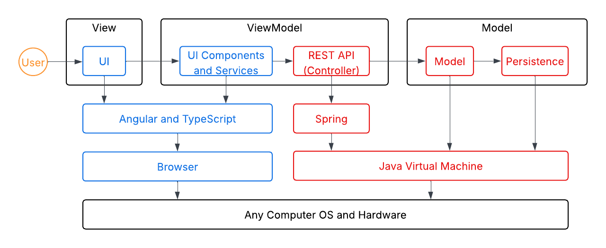

The web application, is built using the Model–View–ViewModel (MVVM) architecture pattern. 

The Model stores the application data objects including any functionality to provide persistance. 

The View is the client-side website built with Angular utilizing HTML, CSS and TypeScript. The ViewModel provides and uses RESTful APIs so that the client (View) may interact with and manipulate the data objects in the Model.

Both the ViewModel and Model in the API are built using Java and Spring Framework. Details of the components within these tiers are supplied below.

### Overview of User Interface

This section describes the web interface and flow; this is how the user views and interacts with the web application.

#### Sprint 1 Sketch

The following is a sketch of our plan for the helper page, where helpers, once logged in, will be able to move needs between the cupboard and their basket. They can also search for needs with a search bar, or logout if they want to leave. Once they are ready, there will also be a checkout button so that they can finalize their contributions. 

#### Initial Draft of Application's UI Flow

The application's UI will feature a home page that initially shows users a list of ongoing famine efforts. This page will also direct them to a sign-in page, where they can enter their username and password in order to log into their accounts. From here, the admin will see a master page where they can add, remove, and edit needs, while the helpers will see their basket and a list of needs, which they are able to move specific things between. From these pages, all users will have the ability to logout with a logout button near where the original login button was. Additionally, each page will have a button to take the user back to their primary screen (determined by what account they are signed in as).

The following are sketches of the Login and Admin pages. The above image, which is a sketch of the Helper page, also represents a part of the UI.

#### Flow of the Application's Current UI

The user starts on the home page of the website, where they are able to see and search for all the famine efforts, but are not able to edit them or add them to a basket. 
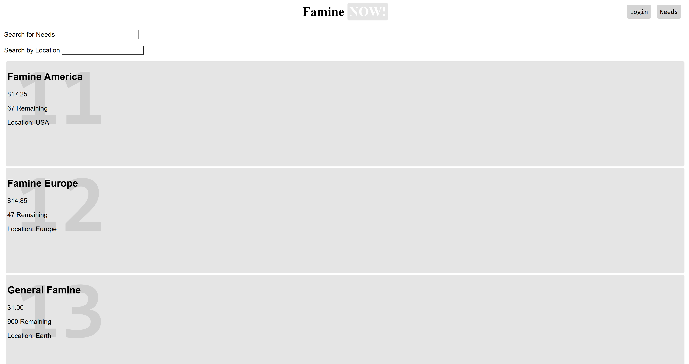

From here, by going to the top right and pressing the "Login" button, the user gets taken to the login page. Here, they can enter their account information to log-in to their account. Once done, they can press the "Needs" button in the top-right corner to get back to the home page.
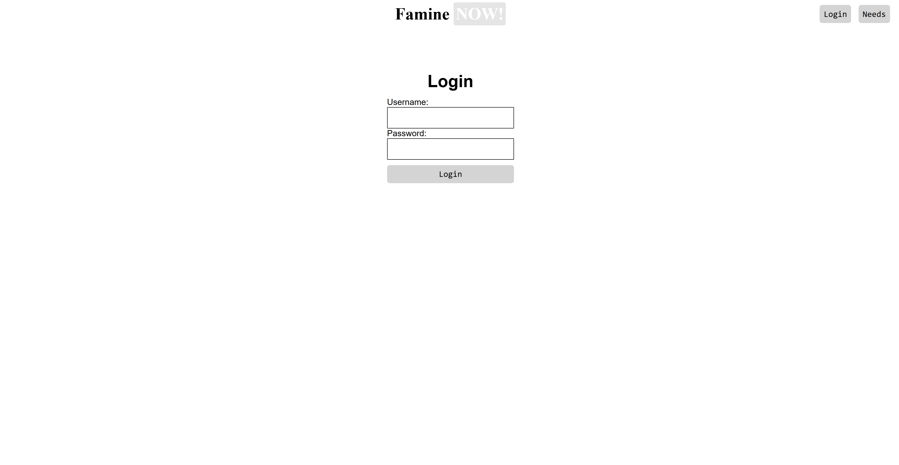

Once back on the home page, the user sees different things based on what account they logged into. If the user is an admin, they will see a Need creator at the top of the page that allows them to create new needs. Additionally, needs have an extra button that allows them to edit the textboxes for a need's data fields.
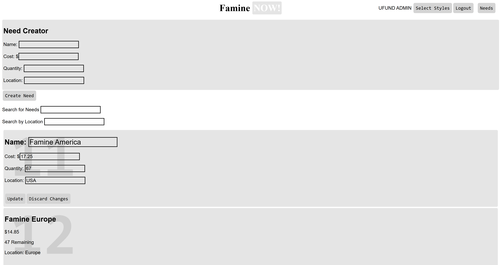

Otherwise, if the user is logged into a helper account, they see a few new input fields where they can set quantities of a need and add that much to their cart. Once a need is in the user's cart, these fields change to allow the user to modify the amount stored in their cart or remove the item entirely.
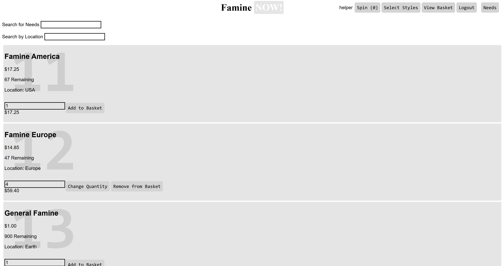

The helper can also now navigate to two more pages. The first page shows the user their basket, allowing them to checkout with a botton at the bottom of the page. The second page shows a spinner with different styles listed in each section, which the user can press on to get a random style, assuming they have enough spins left.
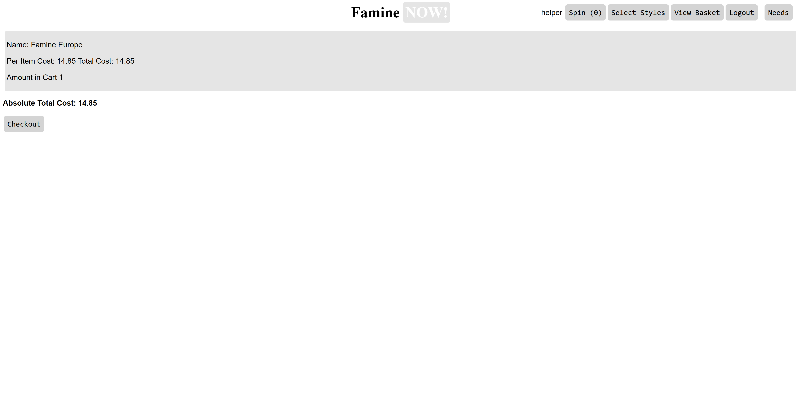
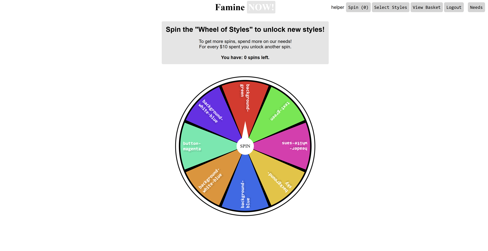

The last page, accessible by both admins and helpers, is the styles page, which shows the user which styles they have selected and allows them to change it.
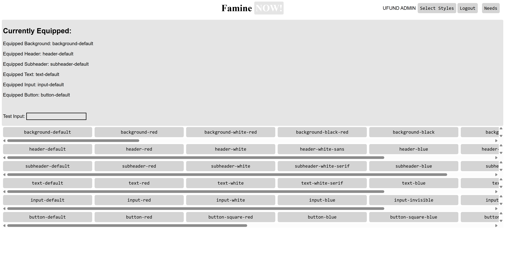

All of these pages can be accessed through buttons in the top-right corner when the correct user is logged in. Additionally, the logout button replaces the previous login button, and, once clicked, reroutes the user back to the login page.

As recommendations for the future, we could better format the navigation bar. For starters, each page has the website's logo at the top, but instead of having that take the user back to the home page like most websites, we give that responsibility to a button not-so-descriptively labelled "Needs". The login and logout button should also be the furthest-right button to match common standards.

Another recommendation is that the helper should be able to edit their basket from the basket page, instead of having to go back to the home page and do that there.

### View Tier
The view tier of our application includes all of the component HTML and CSS with each angular component. This includes the components:
- login-page
- lootbox (internal name for the wheel)
- needs
- user-basket (internal name for the checkout page)
- user-info
- user-styles

And of the non-components:
- app.html
- styles.css

Each of the component views is responsible for the different pages that a user (mostly for the helpers) can be on in our application. Of course app.html simply includes router links, a button to get to the needs page (as that is the same regardless of log-in status) and the website's header. The most significant part of our view tier is the main styles.css file, which contains all of the css variables and where they are applied based upon the selections a user can make.

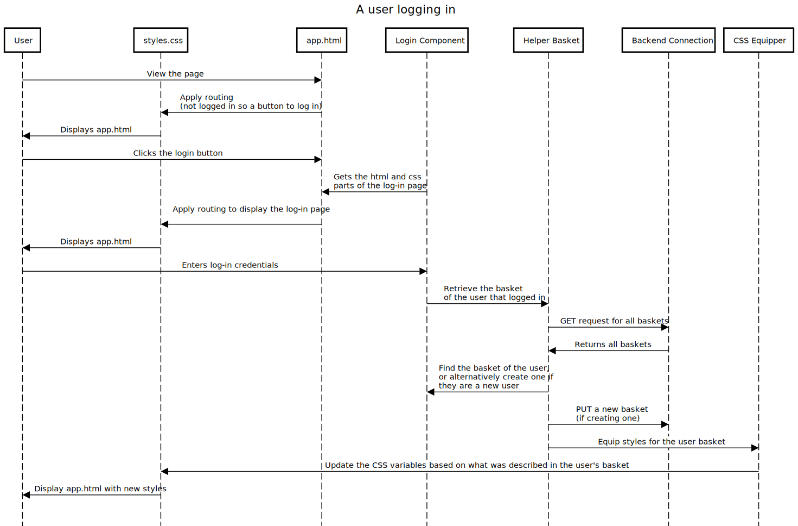
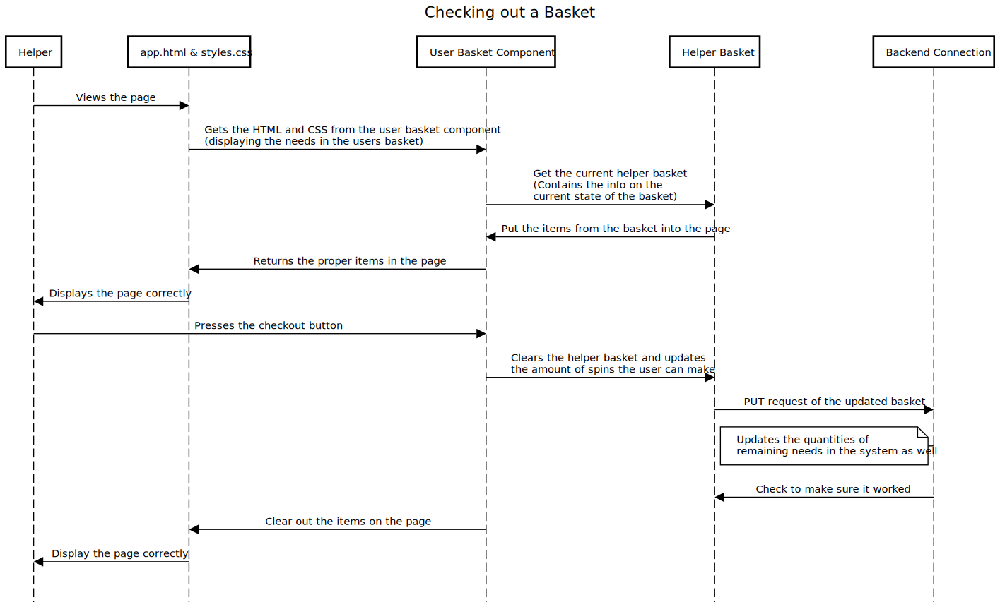

### ViewModel Tier

In the API, the ViewModel Tier includes the following classes:
- BasketsController: Receives and processes all "\baskets" HTTP requests.
- CupboardController: Receives and processes all "\cupboard" HTTP requests.

Meanwhile, in the UI, the ViewModel Tier includes the following Typescript components:
- login-page.ts: Handles logging-in logic.
- lootbox.ts: Handles all logic pertaining to the wheel and bestowing new styles onto a user.
- needs.ts: Handles all logic with displaying the cupboard and allowing needs to be added into a users cart, as well as allowing an admin to create, edit, and delete needs.
- user-basket.ts: Contains all logic for checking out a user's basket.
- user-info.ts: Contains all the relevant info for a user to display in the top right of the page (buttons).

Additionally, the ViewModel Tier in the UI also consists of the following Typescript services:
- backend-connection.ts: Connects to the SPRING server and enacts all HTTP requests from the typescript components.
- css-equipper.ts: Handles all logic for changing the variables in styles.css based on selected styles in the user's basket.
- helper-basket.ts: Contains a copy of the current user's basket, used among most of the typescript components that affect a basket. Calls the backend-connection when a relevant update to the basket is made.

The ViewModel tier is responsible for communication between the UI (View) and the API (Model). It is the central component for data persistence, as it allows user actions in the UI to manipulate data in the backend, as well as enabling data in the backend to be properly reflected in the UI.

In the UI, the Angular service BackendConnection sends HTTP requests to alter or access data in the backend. It then receives the responses sent by the API, and gives the information in the response to the component or service that handles the logic for that particular data.

In the API, the BasketsController and CupboardController classes receive HTTP requests, calling the necessary functions in order to process it. Once it updates the backend--or encounters an error that prevents it from doing so--it sends a response back with the related data and an HTTP status code.

### Model Tier

The Model Tier includes the following classes:
- Basket: Defines the structure of user baskets that are stored by the server. Since each basket is tied to a particular user, these objects will also store the user-owned page styles and the particular ones that they have selected.
- BasketsDAO (interface)
- BasketsFileDAO: Provides implementation for the BasketsDAO functions in order to save, retrieve, update, and delete user baskets stored on the server.
- Need: Defines the structure of the famine needs that are stored by the server.
- NeedDAO (interface)
- CupboardFileDAO: Provides implementation for the NeedDAO functions in order to save, retrieve, update, and delete famine efforts stored on the server.

The model tier contains the structure for the Baskets and Needs, which also provides the JSON structure for those objects as they appear in the server. Additionally, this tier contains the FileDAOs, which contain the functions that execute CRUD commands onto the server. The BasketsFileDAO works with the JSON data for Baskets, while the CupboardFileDAO works with the data for Needs.

## OO Design Principles

1. Our product encapsulates the **Controller** principle, which requires distinct, non-UI objects be assigned the responsibility to receive and coordinate system operations. We do this through the BasketsController and CupboardController classes, which are classes within the api that take requests for specific information and runs the related system functions to process those requests.

2. Our product follows the **Single Responsibility** principle, which states that classes should only have one responsibility. It does this by splitting the four main responsibilities--processing HTTP requests and modifying data in the server for both the cupboard and the user baskets--into four different classes. By doing this, each of these classes only has one responsibility, and they are, in turn, simpler to understand.

3. Both our website and backend follow the **Dependency Injection/Inversion** principle, in which low level objects do not instantiate dependent objects and are instead given (or injected) them from higher modules. In the website, BackendConnection and HelperBasket are services that get injected into the different pages in order to handle persistent data and communication with the backend. Meanwhile, in the backend, CupboardController and BasketsController, which receive and respond to HTTP requests, are given CupboardFileDAO and BasketsFileDAO, respectively, when created in order to properly handle these requests. As a result of this practice, we are able to increase the coverage of our unit tests by making and injecting expansive mock objects, rather than being forced to just test with real, yet narrow-focused, ones.

4. Our API supports **Pure Fabrication**, where non-domain entities are created to maintain single responsibility and low-coupling in domain entities. In our API, our domain entities are Basket and Need, which have the responsibility of storing user-based and need-based information, respectively. These responsibilities do not, however, include updating and sending that data from the database. To maintain single responsibility in the Basket and Need classes, we created four other entities--BasketsFileDAO, BasketsController, CupboardFileDAO, and CupboardController--to handle the tasks. As a result, these classes were purely fabricated.

## Static Code Analysis/Future Design Improvements

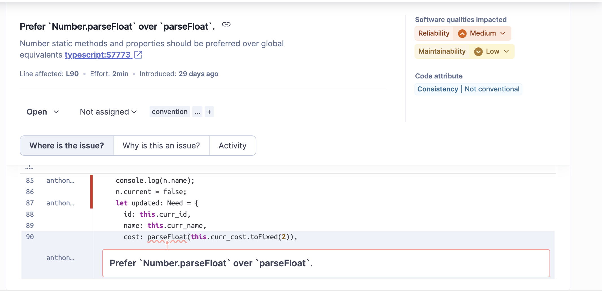

Though Number.parseFloat and parseFloat are functionally the same, the former is less ambiguous, and therefore better-defined semantically, than the latter. Additionally, using the modularization of Number.parseFloat would promote consistency if we were to also use other number-related methods, since they are all accessed from the Number scope. To fix this issue, it is recommended that we refactor the code to ensure that we call global functions through their modular alternatives. 

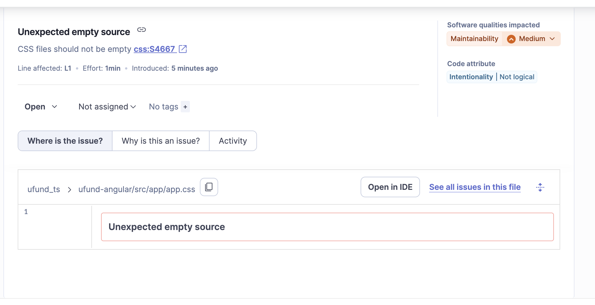

The file being flagged, app.css, is an entirely blank file that serves no purpose to the project. This wastes storage, since even though the file's contents are emtpy, it still has metadata that is being stored. It is recommended that we go through the project and remove empty files so that our project may not be as large.

The issue being flagged in this picture is the function's high Cognitive Complexity, essentially meaning that the section of code could be difficult to comprehend. SonarQube determined this difficulty based on the nested conditions, as well as the long chain of else-if statements. Since, according to SonarQube, this code only needs minimal (1) changes to resolve the complexity, the best way to refactor the code would be to create a new function containing the else-if chain, which then gets called when the condition in line 204 is met. By doing this, we would decrease the complexity of the code to just under SonarQube's recommended threshold.

Separate from the Static Code Analysis, one key area that the team would refactor if we had additional time would be the structure of the backend. There are inconsistencies in naming (like the mixing of the terms "Need" and "Cupboard"), incorrectly named classes (the Basket class contains information relevant to a User beyond the contents of their basket), and, overall, better ways to store the data that would make the API more manageable. As a result of these flaws, both the process of updating the backend in Sprint 3 so that it may accomodate our enhancements became and the writing of unit tests became overly difficult, as they required an understanding of the backend that was hard to achieve by reading it and our documentation.

## Testing
This section provides information about the testing performed and the results of said testing.

### Acceptance Testing

Passed: 19;
Failed: 0;
Untested: 0

Issues: None

### Unit Testing and Code Coverage

We utilized JaCoCo when designing our unit tests to see which branches of functions had not yet been tested. We then picked mock values that we felt targetted these branches and ensured that they both adequately covered the code and worked correctly. By doing this, we ended with an instruction coverage of 90% and a branch coverage of 94%, which covers the entire API except for a few error handlers that were deemed to not run, as is mentioned in more detail below.

*Coverage Report from Sprint 2*

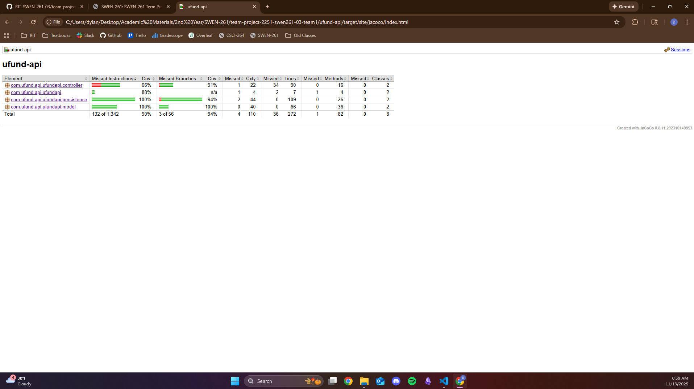
*Coverage Report from Sprint 3 and 4*

The low coverage for the controller tier can be attributed to missing tests for when the backend encounters IOExceptions while handling HTTP requests. Most of these exceptions would rarely arise, however, as the issues that cause them also result in errors during earlier parts of the program. As such, these checks are redundant, and testing them was deemed low priority (especially since adding this to the test for UpdateNeeds of the CupboardController took two hours).

## Ongoing Rationale

**(2025/11/18) Decision on Rationales:** We have decided that we are content with having no other major decisions, and that this section will be left otherwise blank
